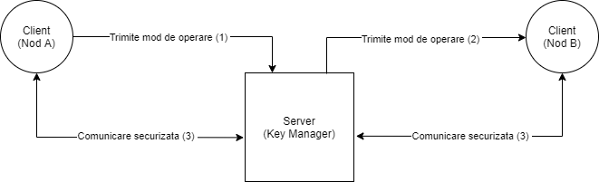
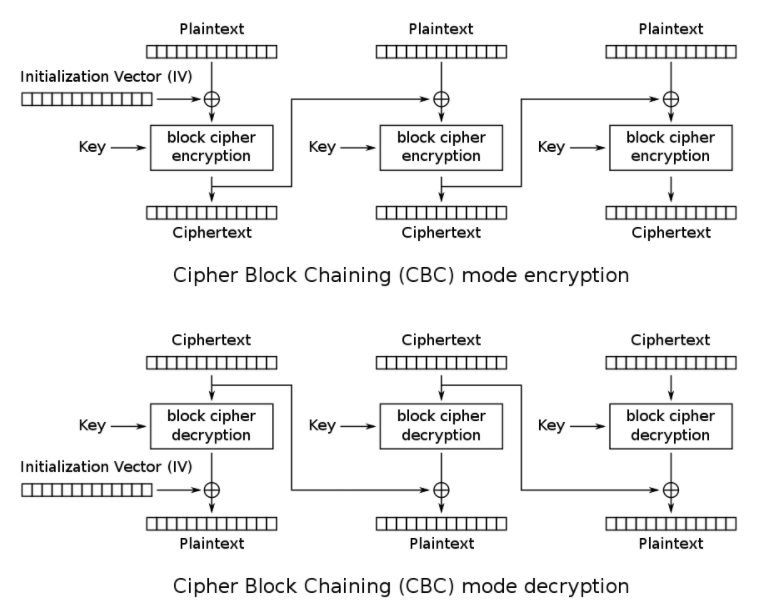
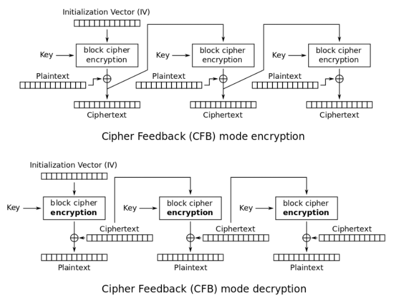

# Tema1-SI
## Descrierea aplicației
  Această aplicație are rolul de a simula o infrastructură de comunicație ce utilizează criptosistemul AES. Are o arhitectură de tipul client-server, serverul, numit "Key Manager", are scopul de a comunica cu nodurile A și B, iar clienții sunt două noduri (A și B) care vor avea rolul de a cripta un fișier text într-un mod ales (CBC/CFB), respectiv de a decripta în celălalt mod și afișa pe ecran mesajul inițial. 
  Diagrama aplicației:  
  
  

## Implementarea criptării
  Pentru criptarea mesajelor au fost folosiți algoritmii CBC și CFB. Acești algoritmi au fost implementați după schemele de mai jos, împărțind mesajele în blocuri de câte 16 octeți, aplicând operația xor și criptarea cu cheia și vectorul de inițializare corespunzătoare: 

 
 
## Cerințe preliminare
  Pentru a putea folosi aplicația trebuie să:
  - instalați interpretorul Python
  - executați următoarele comenzi în directorul proiectului:
    - pip3 install pycryptodome
    - easy_install http://www.voidspace.org.uk/python/pycrypto-2.6.1/pycrypto-2.6.1.win32-py2.7.exe
    
  Acum puteți lansa aplicația. Rulați în această ordine: **server.py, client_A.py, client_B.py.** Pentru a modifica textul ce se dorește a fi criptat și decriptat, editați fișierul **fisier.txt**.
 
## Librării folosite
  - socket: pentru comunicarea dintre clienți și server
  - random: pentru generarea de chei sau vectori de inițializare random
  - Crypto.Cipher: pentru a folosi algoritmii de criptare/decriptare puși la dispoziție de limbajul de programare Python

## Link-uri utile
  1. https://www.novixys.com/blog/using-aes-encryption-decryption-python-pycrypto/
  2. https://en.wikipedia.org/wiki/Block_cipher_mode_of_operation
